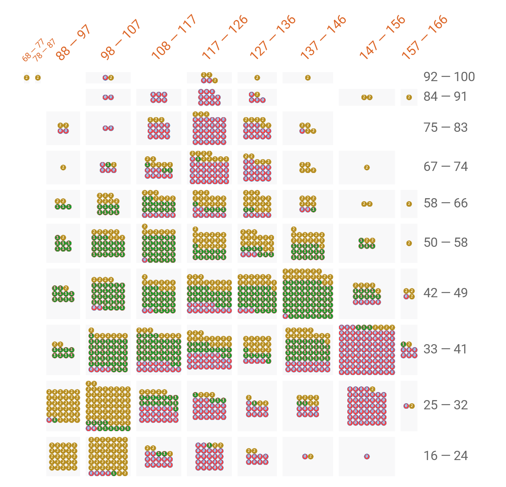

# Crash Risk Calculator

Calculates the risk of an accident from 3 basic inputs

App hosted here: https://djcordhose.github.io/crash-risk-calculator/

## Data

The data set consists of 1500 samples for three categories, 500 samples each:

*  0 - red: many accidents
*  1 - green: few or no accidents
*  2 - yellow: in the middle

You have three variables to infer the category from
1. Top speed of car
1. Age of driver
1. Miles per year

The data: https://raw.githubusercontent.com/DJCordhose/deep-learning-crash-course-notebooks/master/data/insurance-customers-1500.csv

## Overview

You can use https://pair-code.github.io/facets/ to bucketize the data using speed and age

which already gives you a good overview how you would score each bucket.

